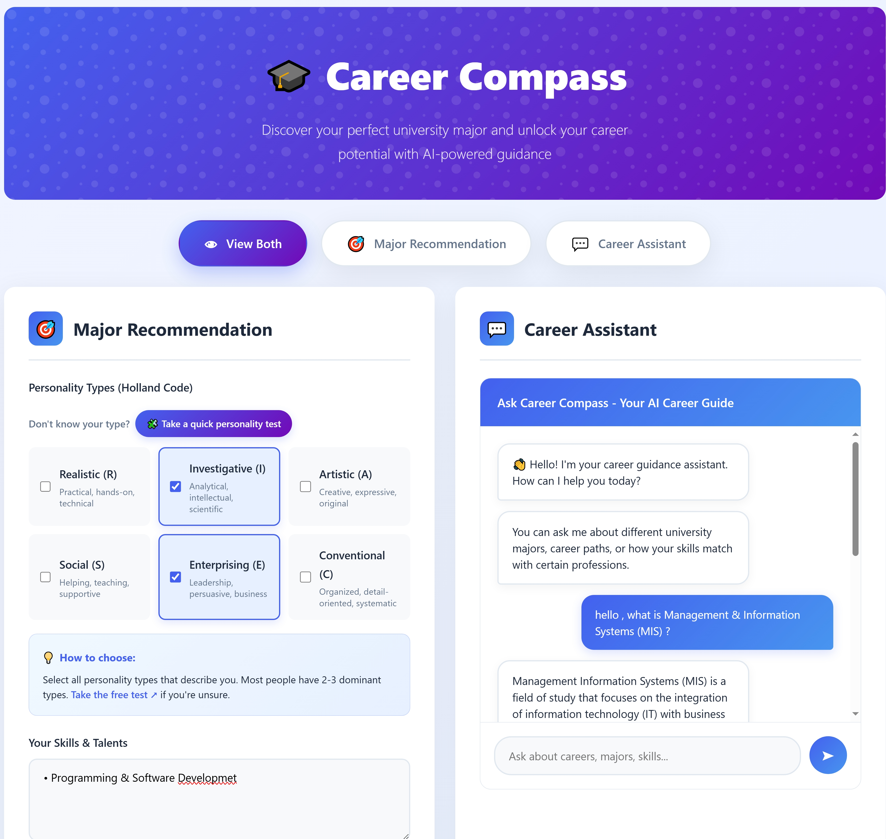
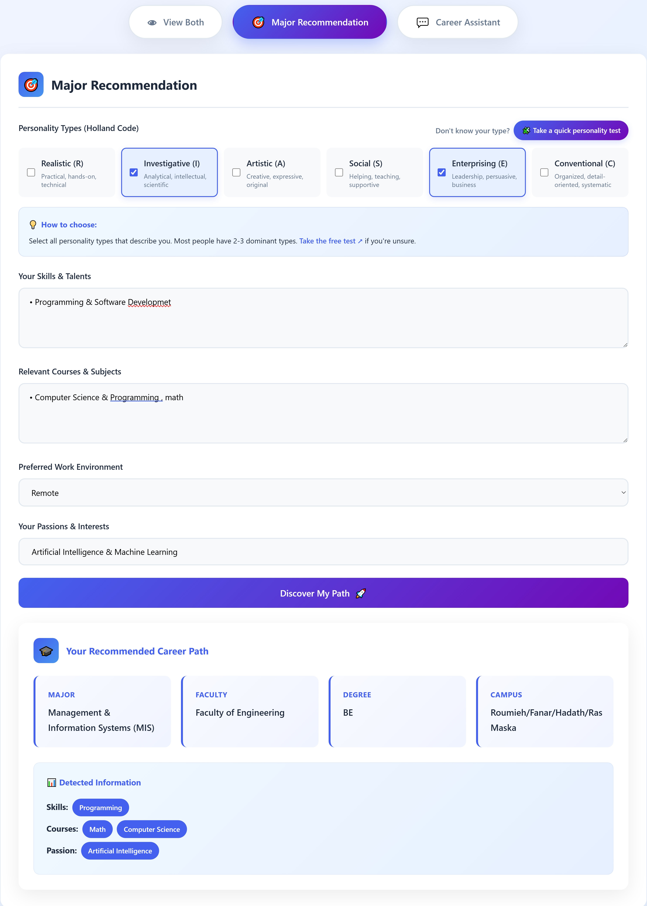
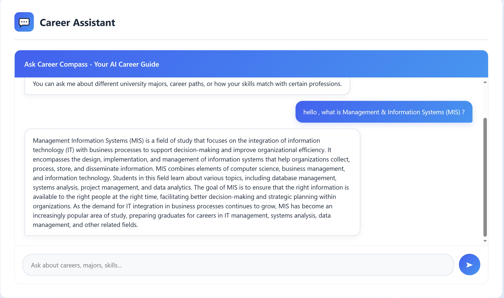

# 🎓 EduPath AI — Intelligent Career & Major Recommendation System  

> 🚀 Empowering students to make smarter academic choices through Machine Learning and AI-powered guidance.

<p align="center">
  
</p>

<p align="center">
  <a href="https://fastapi.tiangolo.com"></a>
  <a href="https://www.docker.com/"></a>
  <a href="https://render.com/"></a>
  <a href="https://scikit-learn.org/"></a>
  <a href="#"></a>
</p>

---

## 🧭 Overview  

**EduPath AI** is a smart career guidance system designed to help students discover the most suitable **university major and career path** based on their **skills, personality, and passions**.  

Built using **FastAPI**, **Machine Learning**, and **NLP**, it bridges the gap between students’ academic potential and Lebanon’s educational programs.  

It combines two main AI components:  
- 🎯 **Major Recommendation Engine** (Random Forest Classifier)  
- 🤖 **AI Career Chatbot** (RAG-based system powered by Weaviate & LLMs)  

Both are deployed via **Docker** on **Render Cloud**, providing a **production-ready, scalable web experience**.  

---

## 🌟 Key Features  

✅ Personalized major recommendation for Lebanese University students  
✅ Interactive AI chatbot for career & skill guidance  
✅ Locally curated dataset from Lebanese University majors  
✅ Scalable FastAPI backend with Docker deployment  

---

## ⚙️ Tech Stack  

| Layer | Technologies |
|--------|---------------|
| **Framework** | FastAPI |
| **Machine Learning** | scikit-learn (Random Forest) |
| **NLP / Chatbot** | Weaviate · Hugging Face Embeddings · LLM |
| **Containerization** | Docker |
| **Deployment** | Render Cloud |
| **Development Tools** | Google Colab · VS Code · Python 3.10 |

---

## 📊 Datasets  

### 🧠 Major Recommendation Model  
- **Dataset:** `LU_Major_Recommendation_Dataset_New` (Generated via DeepSeek)  
- **Features:** RIASEC traits, skills, interests, preferred subjects, work styles  
- **Output:** Faculty, Program, Degree, Campus (Lebanese University)  

### 💬 Chatbot Dataset  
Merged from Hugging Face datasets:  
- `Career_counseling_data`  
- `VamshiSurya/Career-Guidance`  
- `Pradeep016/career-guidance-qa-dataset`  
➡️ Combined into one clean dataset: `final_merged_career_guidance`

---

## 🧩 System Architecture  

1. User enters skills, interests, and personality type.  
2. Random Forest Model predicts the best-fit **major and faculty**.  
3. RAG Chatbot provides real-time career guidance and skill advice.  
4. FastAPI serves predictions and chat responses through a web interface.  

<p align="center">
  
</p>

---

## 🧠 Model Details  

| Component | Description |
|------------|--------------|
| **Algorithm** | Random Forest Classifier |
| **Accuracy** | ~95% |
| **Preprocessing** | Text normalization, encoding, fuzzy matching |
| **Evaluation** | Accuracy, Precision, Recall, F1-score |

---

## 🤖 Chatbot Overview  

Powered by **Retrieval-Augmented Generation (RAG)**:  
- Uses **Weaviate Vector DB** for semantic search  
- Embeds text with **sentence-transformers/all-MiniLM-L6-v2**  
- Generates conversational responses using an integrated **LLM**

Students can ask questions like:  
> “What skills do I need for Data Science?”  
> “Which certifications are best for cloud careers?”  

<p align="center">
  
</p>

---

## 🚧 Challenges & Solutions  

| Challenge | Solution |
|------------|-----------|
| 🧠 Complex user text input | Implemented NLP preprocessing & fuzzy string matching |
| 📉 No Lebanese-specific dataset | Created a custom LU dataset using DeepSeek generation |
| 💾 Render memory limits | Optimized Docker image and lazy-loaded ML models |
| 🌐 Language variety | Normalized Arabic-English hybrid entries |

---

## 📈 Results  

| Component | Metric | Score |
|------------|---------|--------|
| Major Recommendation | Accuracy | **95%** |
| Chatbot Guidance | Relevance | **~90%** |
| Web Performance | Latency | **<2 seconds** |

---

## 🚀 Future Enhancements  

🔹 Integration into **Lebanon’s Ministry of Education** platform  
🔹 Adoption by **schools & universities across Lebanon**  
🔹 Expanded dataset with **local student profiles**  
🔹 Counselor dashboard for **data analytics & insights**

---

## 👩‍💻 Team  

| Member 
|---------
| **Amal Cheikh Ali** | 
| **Maysam Al Obaidi** |
| **Fadila Al Omar** | 

---

## 🔗 Links  

📂 **GitHub Repository:** https://github.com/Amal-ai25/Ai-career-path-navigator-zaka  
🌐 **Live Demo (Render):** *(Coming Soon)*  

## Setup Instructions

 **Clone the repository**
   ```bash
   git clone <your-repo-url>
   cd CareerCompass

---

<p align="center">
  ⭐ *If you liked this project, consider starring it — your support means a lot!*  
</p>

<p align="center">
  <b>© 2025 EduPath AI | Built with ❤️ in Lebanon 🇱🇧</b>
</p>
